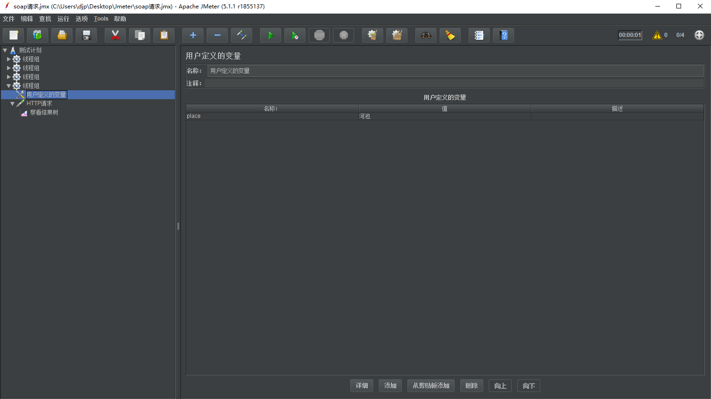
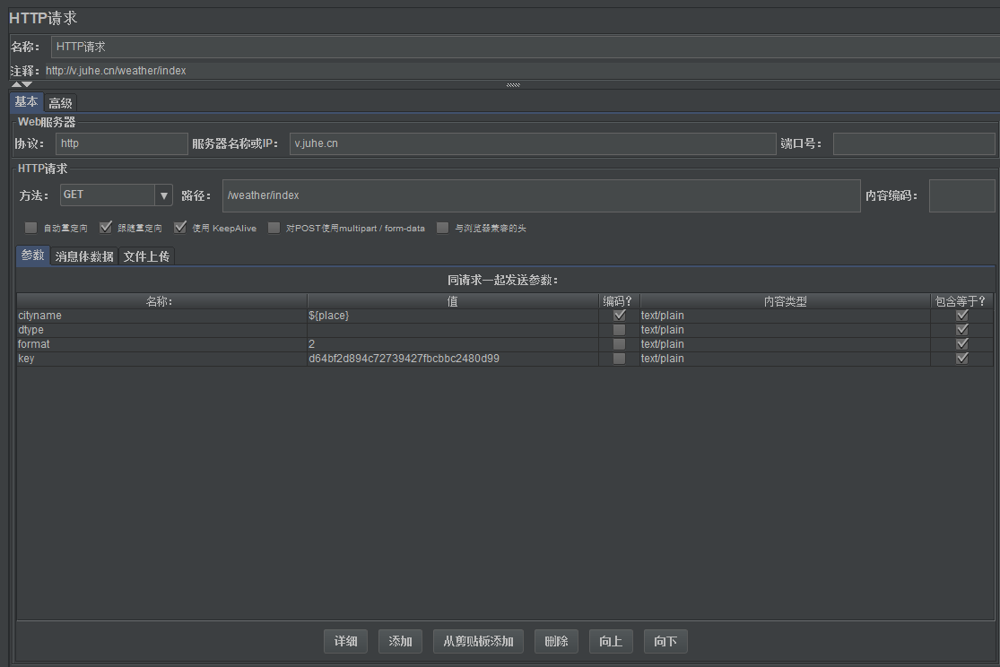
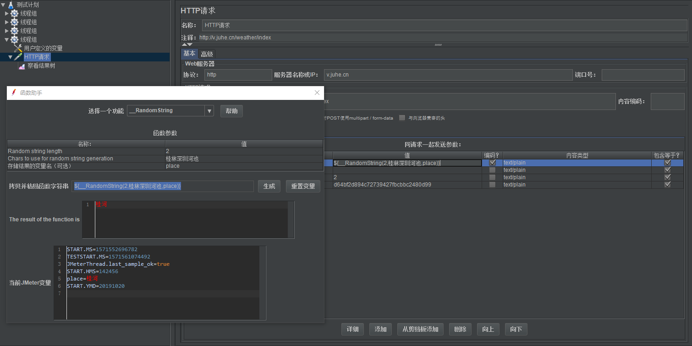
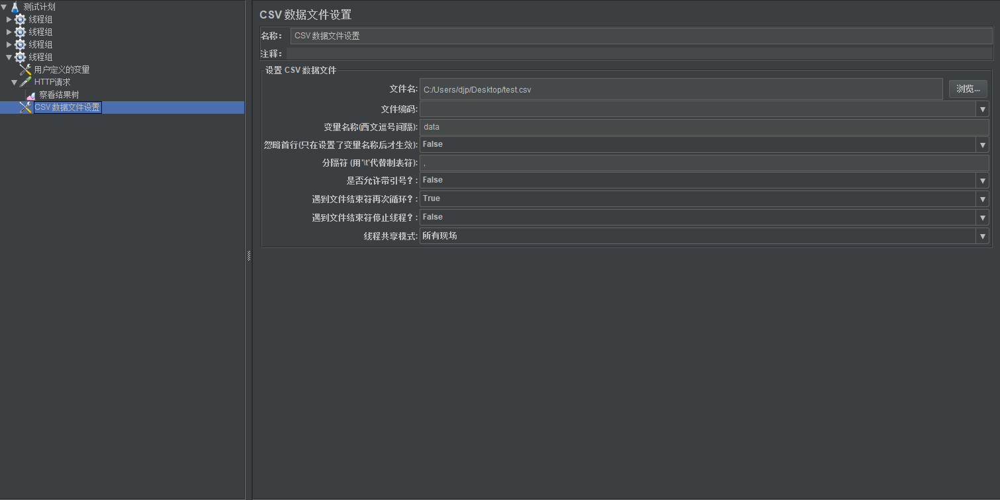

# Jmeter

## http请求  get方法
##### 需求文档
    接口地址：http://v.juhe.cn/weather/index
    返回格式：json/xml
    请求方式：get
    请求示例：http://v.juhe.cn/weather/index?format=2&cityname=%E8%8B%8F%E5%B7%9E&key=您申请的KEY

- ###### http请求

- ###### 察看结果树

## soap请求  post方法
`SOAP：简单对象访问协议，简单对象访问协议（SOAP）是一种轻量的、简单的、基于 XML 的协议，它被设计成在 WEB 上交换结构化的和固化的信息。`

使用“腾讯QQ在线状态 WEB 服务”做示范
[qqOnlineWebService](http://www.webxml.com.cn/webservices/qqonlinewebservice.asmx)

- ###### soap请求
`xml请求放到body data`

- ###### HTTP信息头管理器

- ###### 察看结果树

## HTTP Cookie管理器
`如果你有一个 HTTP 请求，其返回结果里包含一个 cookie，那么 使用JmeterCookie管理器会自动将该 cookie 保存起来，而且以后所有对该网站的请求都使用同一个 cookie。每个 JMeter 线程都有自己独立的”cookie 保存区域”。`
    
- ###### 登陆

- ###### 保存cookies

- ###### 同域名使用

- ###### 使用cookies

## 参数配置
- ###### 自定义变量
`在多个请求使用同一个参数的时候可以使用（全局）`
    
     

- ###### 随机函数使用
`在字符串中随机抽取指定位数，常用于随机数字（电话号码）`**中文字符串暂未找到方法**

- ###### 配置文档
`可以使用csv文件或者txt文件，注意乱码问题~`:cyclone:
    

